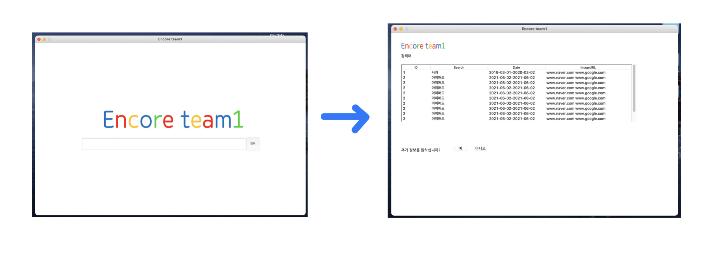

# Mini-Project2
### 최종 결과물

* 구글 검색창의 이미지를 생각하여 생성했습니다. 

### DB를 통한 파이썬 GUI 연동

* GUI에서 검색받은 결과를 DB로 전달

* DB에서 검색어를 테이블로 생성해서 다시 GUI에 나타냄

* 실시간으로 테이블과 그림이 갱신될 수 있도록 수정

  

### 오라클 DB

* 기존 크롤링한 결과를 DB 테이블로 연동
* PL/SQL로 프로시저 생성

### 파이썬 GUI

* tkinter 모듈을 사용
* 결과를 GUI로 표현

